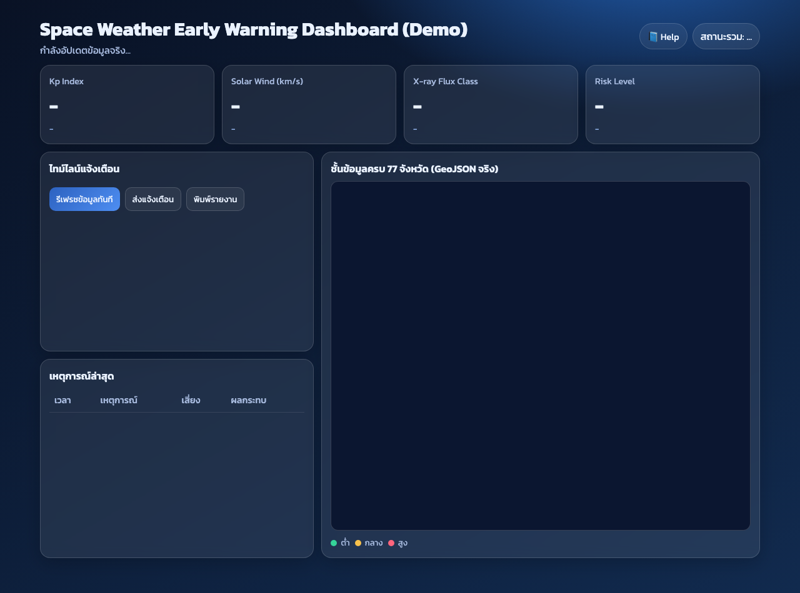

# Space Weather Early Warning Demo




เดโมแดชบอร์ดสภาพอวกาศแบบใกล้โปรดักชัน
- Frontend: `public/index.html` + `public/app.js`
- Backend: `server.js` (Node.js built-in HTTP, ไม่ต้องติดตั้งแพ็กเกจเพิ่ม)
- Data Source: NOAA SWPC (real-time-ish) พร้อม fallback อัตโนมัติ
- Province Layer: `public/data/th-provinces.geojson` (ครบ 77 จังหวัด)

## Run

```bash
cd /Users/vikornsak/.openclaw/workspace/space-weather-demo
node server.js
```

เปิดเบราว์เซอร์:

- Dashboard: http://localhost:8787
- Help (คู่มือคำอธิบายตัวแปร/ศัพท์): http://localhost:8787/help.html
- Health check: http://localhost:8787/health
- API: http://localhost:8787/api/space-weather

## จุดเด่น

- ดึงข้อมูลจริงจาก NOAA (`Kp`, `Solar Wind`, `X-ray`)
- คำนวณ `Risk Level` (ต่ำ/กลาง/สูง)
- Timeline + Incident table
- หาก API ภายนอกล่ม: ระบบยังแสดงผลได้ด้วยข้อมูลสำรอง
